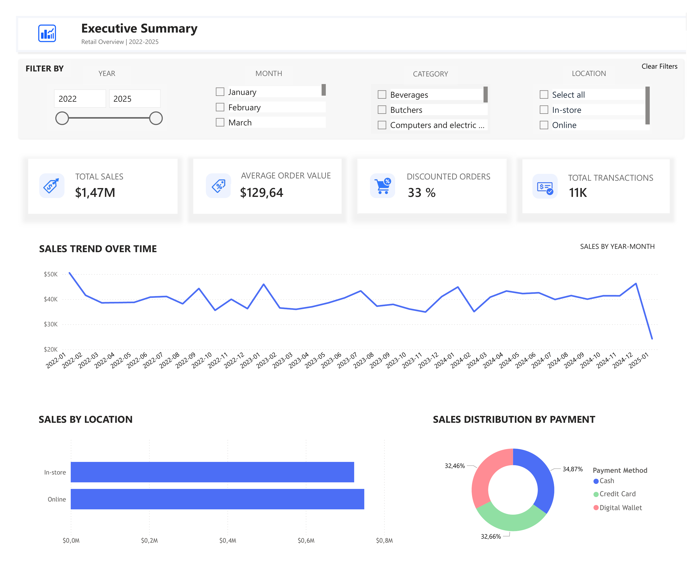

# 🛍️ Retail Sales Insights Dashboard – Power BI

This project features an interactive dashboard built in Power BI to analyze retail sales data, identify product performance trends, and evaluate discount impacts.

## 📊 Dataset
- 12,000+ rows of dirty retail transaction data
- Cleaned, transformed, and modeled using Power Query & DAX

## 🔧 Key Features
- KPI Cards: Total Sales, Avg. Order Value, Discounted Orders, Transactions
- Time Series Analysis: Monthly sales trends
- Category/Item Performance: Which products drive the most revenue?
- Discount Analysis: Revenue comparison between discounted and non-discounted orders
- Dynamic Filters: Category, Year, Month, Channel

## 🔍 Insights
- ~33% of all orders were discounted — suggesting strong reliance on promotions
- Butchers and Food items consistently led revenue performance
- Sales peaked in late 2024, indicating seasonal demand patterns

## 📷 Dashboard Preview

## 🛠️ Tools Used
`Power BI`, `Power Query`, `DAX`, `Data Cleaning`, `Data Modeling`, `Retail Analytics`
